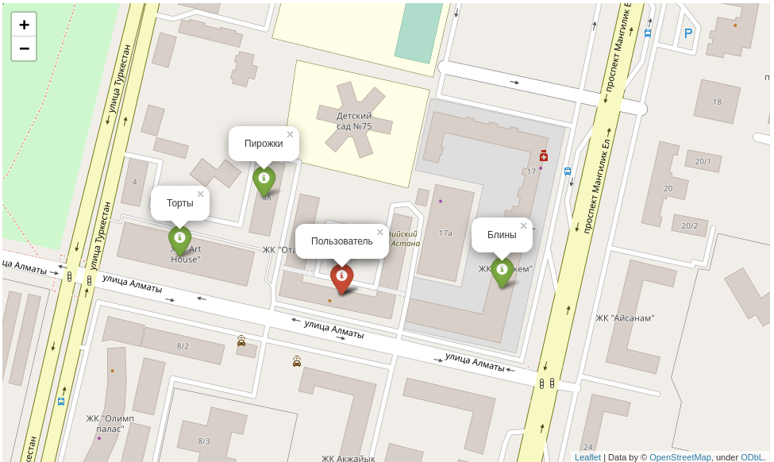

# Korshi Komekshi

Korshi Komekshi is an InDriver for services and goods.

This repository contains instructions for creating Optimized Database and Main Operations of the Backend: 
* addition of new Service/Good
* optimized search of Services/Goods using coordinates and other specifications of Service/Good  

## Installation
Download repository:
```bash
git clone https://github.com/AmanzholDaribay/ideathon
```
In database directory, Build and Run Database using [Docker](https://www.docker.com/):
```bash
sudo docker-compose up -d
```
Add initial sample data (if you want, update it as you wish):
```bash
python migrations.py
```
Install all necessary dependencies to connect with Database 
(if you need, install into specific virtual environment):
```bash
pip install -r requirements.txt
```

## Usage
### For adding new Service/Good
In [add_new_data.py](add_new_data.py), for adding new Service or good run following:
```python
from main import ManagingDatabase

manager = ManagingDatabase()

service = 'Синнабоны'
category = 'Выпечка'
price = 500
service_lat = 51.115990
service_lon = 71.431238
manager.insert_data(service, category, price, service_lat, service_lon)
```

### For searching Services/Goods
In [searcher.py](searcher.py), for searching Services or Goods within
* specific category (distinct)
* specific price threshold (up to and in kzt)
* specific search diameter/radius  (meters)

run the following:
```python
from main import ManagingDatabase

manager = ManagingDatabase()

category = 'Выпечка'
price = 1000        # kzt
radius = 500        # meters
user_lat = 51.115990        # user latitude
user_lon = 71.431238        # user longitude
Output = manager.request(category, price, user_lat, user_lon, radius)
```
Output:

Note: User in red, Services/Goods in green.

## Credits
For building Database with Postgis extension this project uses [docker-postgis](https://github.com/kartoza/docker-postgis#docker-postgis).